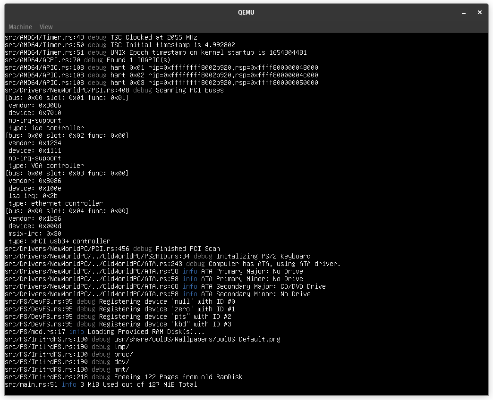

# <br>owlOS

[](https://forthebadge.com)
[](https://forthebadge.com)

## What is owlOS?

**owlOS** is a free, open-source **UNIX**-like operating system made from<br>
scratch in the **Rust** Programming Language. The OS run on top of a<br>
kernel known as the **Fox Kernel**.

---
- **owlOS** tries to implement clean APIs to allow developers to easily create programs.
- **owlOS** features modern concepts inside its libraries like **fibers**.
- **owlOS** is portable.
- **owlOS** is open.



---
## Building

### macOS & Linux

Before trying to build owlOS you need the Rust Toolchain.<br>
You can install it by following the  [offical guide](https://www.rust-lang.org/tools/install). <br>
Follow the instructions given to install Rust onto your computer.<br>

---

**Please use the recommended rustup install process to install Rust 
on your computer. The version of Rust that your package manager
provides will be an old version of Rust. You need Rust 1.60 or
later to compile owlOS. You also need rustup to download the nightly
builds.**

---

Afterwards you need to install the nightly build of `rustc` in order to
build the operating system:
```sh
$ rustup install nightly

$ rustup default nightly
```
---
**Afterwards, please make sure that you have the following software installed:**

- `rustc` needs to be the **Latest Nightly**
- `coreutils` **(or equivilent)**
- `cargo`
- `xorriso`
- `python3`

---
To compile owlOS, you need to know what architecture you want to
target. For this example we'll use `AMD64` (aka x86_64). This is the CPU
architecture that PCs use. Run the following command to build owlOS:
```sh
$ python3 build.py build AMD64 NewWorldPC
```
The build script will automatically create a bootable image for you.

---
**If you want to compile owlOS for an architecture that's not the same
as your host architecture, you'll need to install the appropriate
target or else the build will fail. Here's an example of how to install the toolchain for `RiscV64`:**
```sh
$ rustup target add riscv64gc-unknown-none-elf
```
**Make sure that it ends with
`unknown-none-elf`, `unknown-none`, `none-eabi`, or `none-eabihf`
the other ones are for making software for other operating systems.**
<br><br>
**To see all the targets that Rust officially supports run the following
command:**
```sh
$ rustup target list
```

---
### Windows

owlOS cannot be properly built and ran on Windows, however it is
possible to use WSL (Windows Subsystem for Linux) to compile it.<br>
Other environments like MinGW or Cygwin have not been tested but<br>
should work.

---
## Contributing

owlOS practices "optimistic merging." This means that Pull Requests will be merged as soon as possible.
The reasoning behind this is to keep Pull Requests small and focused on a specific part of owlOS.

**In order for a pull request to be merged, it must meet all of the specified criterias:**
- The commit's name must be short, clear, and must be prefixed with the component in owlOS that was changed. For Example:<br>
```Fox Kernel: Fixed memory leak in AMD64::APIC::EnableHarts```
- The commit must be able to compile and run sucessfully
- The commit must focus on a specific part of owlOS and cannot modify multiple parts. For example: You can't have a commit that focuses on both code in the Fox Kernel and on Documentation at the same time.
- The commit cannot contain any executable files in binary form.

Binaries should be reduced to be as small as possible,
If raster images are included, please use the following command(s) on the images to reduce the file sizes.
- PNG: ```optipng -strip all```
- JPEG: ```jpegoptim -m90```
- BMP: No program needed
- ***Only PNGs, JPEGs, and BMPs should be used for raster images (BMPs are ONLY used if necessary)***

---
## License

owlOS, the Fox Kernel, and their core components are licensed under **the Apache License, Version 2.0**.<br>
The full text of the license is included in the license file of this software package, which can be accessed [here](COPYING).
