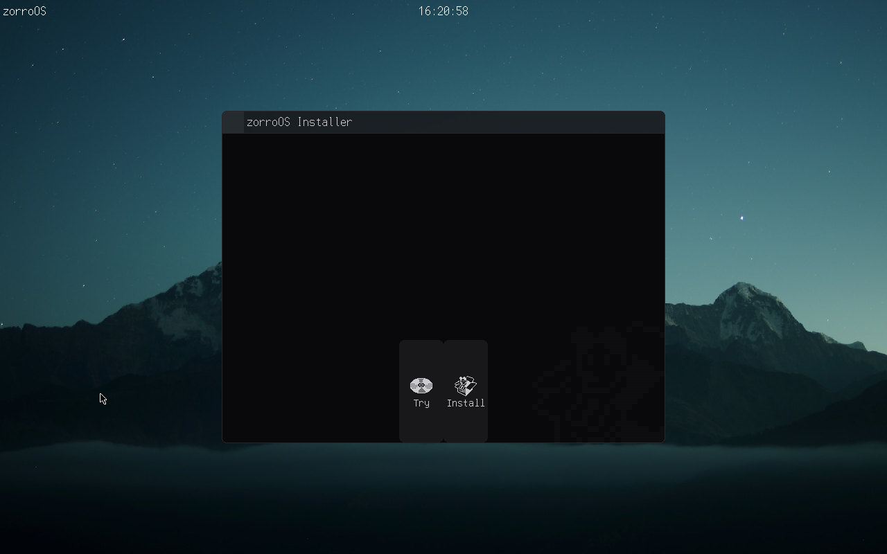
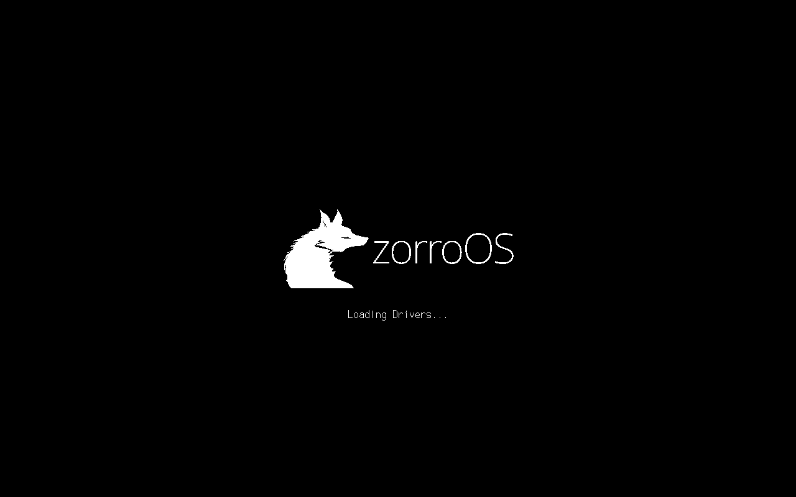
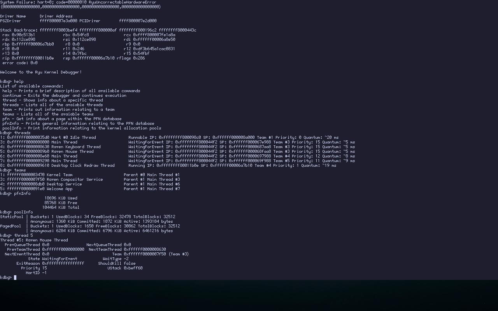

<p align="center"></p>

---

**zorroOS** is a hobby operating system written in Zig, currently targeting x86_64 PCs.





## Building

Building zorroOS is simple.    
First, ensure that you have the following depenedencies:
- `zig` Version: 0.11.0 if its been released, otherwise master (Please open an issue if the specificied version isn't building zorroOS correctly)
- `nasm`
- `python3` (To generate the Icon Pack)
- `xorriso`
- `git`

Then, clone the repository
```sh
$ git clone https://github.com/TalonFox/zorroOS --recursive
$ cd zorroOS
```
After cloning it, simply run `make iso` and a ISO named `zorroOS.iso` will be generated.    
You can then run this using an virtual machine/emulator such as QEMU, Bochs, VirtualBox, or VMWare.
You can also flash this onto a USB drive and boot it onto real hardware, if you would rather do that.

## License

zorroOS is licensed under the MIT License.    
The full text of the license is included in the license file of this software package, which can be accessed [here](COPYING).
